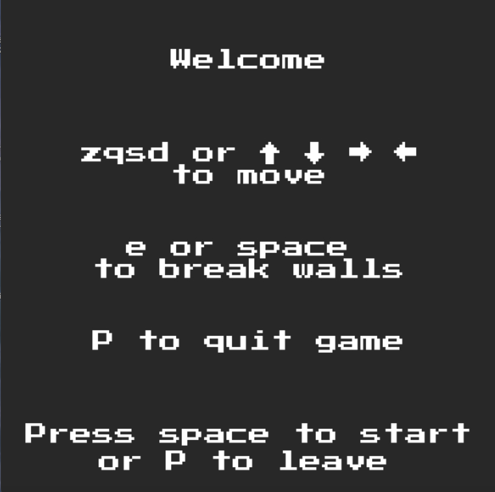
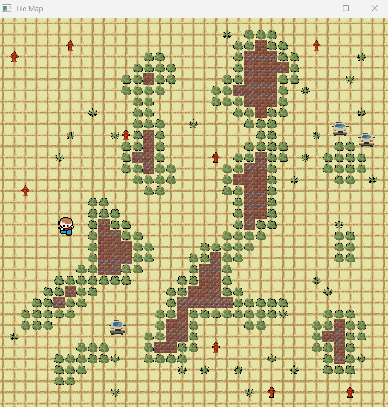
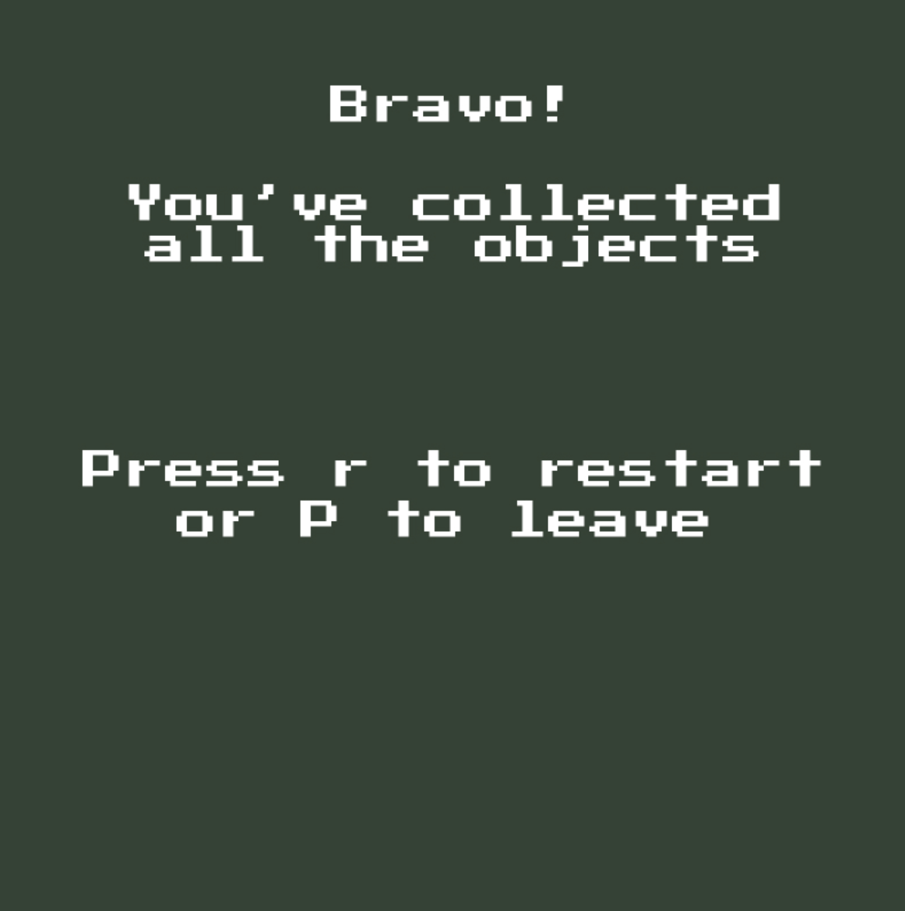
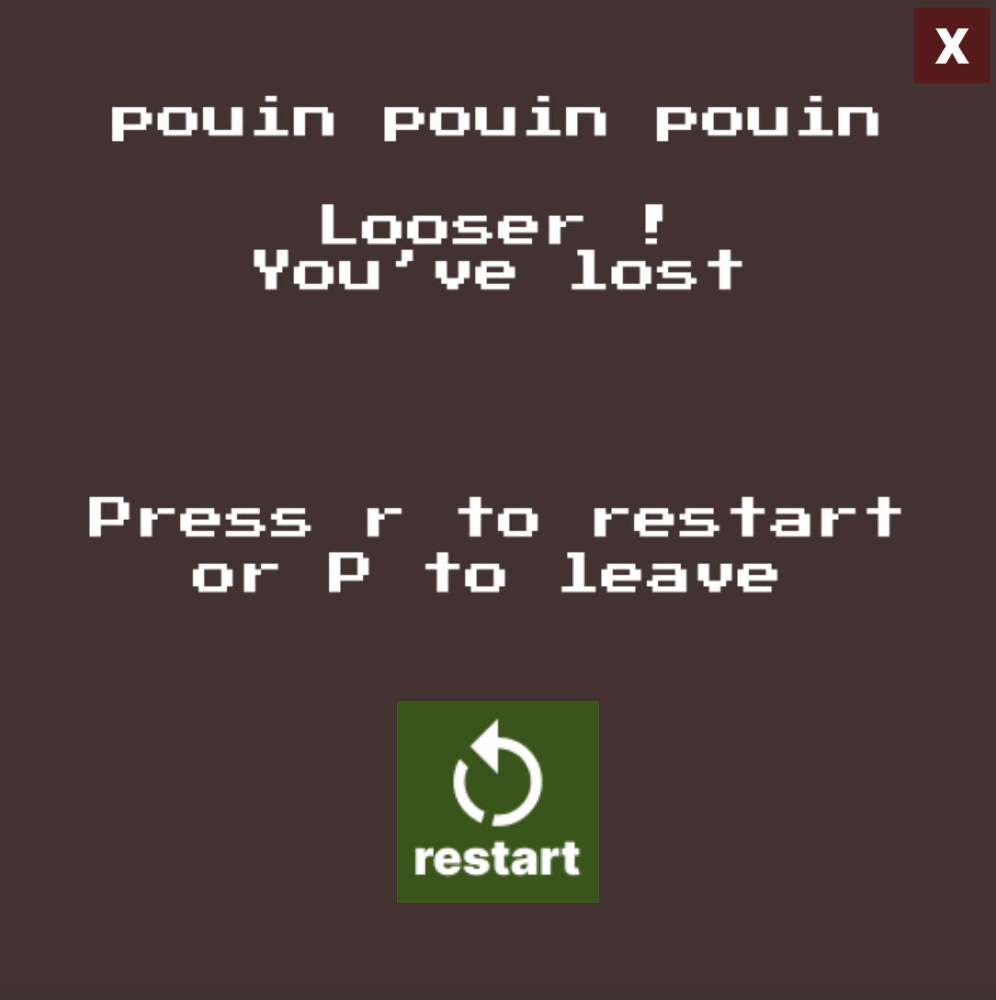

# Rapport du Projet - Jeu Phantom (Digger Game)

## Description du Projet

**Phantom** est un jeu vidéo de type "digger" développé en C++ avec OpenGL. Le joueur évolue dans un environnement de labyrinthe généré procéduralement où il doit collecter tous les objets tout en évitant les ennemis qui le poursuivent et les pièges disposés sur la carte.
Nous avons choisi comme thème la ville : un personnage se promène dans la rue et ramasse des feuilles tandis que la police lui cours après. Il doit éviter de toucher les pompes à eau. Il peut à tout moment tailler les arbustes qui se trouvent sur son chemin pour passer.

## Fonctionnalités Implémentées

### Génération Procédurale de Carte

- **Algorithme de Cellular Automata**
- **Types de cases** :
  - **Empty** : Cases traversables (représentées par ".")
  - **Obstacle** : Murs indestructibles (représentées par "@")
  - **Solid** : Blocs destructibles minables (représentées par "#")
  - **Object** : Objets à collecter (représentées par "O")
  - **Trap** : Pièges mortels (représentées par "X")
- **Optimisations** : Remplissage automatique des espaces vides enfermés pour éviter les zones inaccessibles

### Système de Joueur

- **Déplacement fluide** avec les touches QZSD
- **Textures directionnelles** : Le sprite du joueur change selon la direction (up, down, left, right)
- **Système de minage** : Destruction des blocs solides dans la direction regardée avec E ou Espace
- **Collection automatique** des objets lors du passage dessus
- **Système de score** incrémental
- **Détection de collisions** avec les murs, ennemis et pièges

### Intelligence Artificielle des Ennemis

- **Flow Field (Champ de Flux)** : Algorithme sophistiqué utilisant Dijkstra pour calculer le chemin optimal vers le joueur
- **Pathfinding intelligent** : Les ennemis contournent automatiquement les obstacles
- **Système anti-blocage** : Déplacement aléatoire si l'ennemi reste bloqué trop longtemps (>60 frames)
- **Détection de collision** pour un mouvement réaliste
- **Textures directionnelles** : Les ennemis (police) utilisent des sprites différents selon leur direction de déplacement

### Systèmes de Jeu

- **Écran de démarrage** avec contrôles
- **Conditions de victoire** : Collecter tous les objets
- **Conditions de défaite** :
  - Contact avec un ennemi
  - Marcher sur un piège
- **Écrans de fin** : Game Over et Victory avec scores et temps
- **Système de redémarrage** (touche R)

## Captures d'Écran

### Écran de Démarrage



### Gameplay Principal



### Écrans de Fin





## Guide d'Utilisation

### Commandes

- **Espace** : Démarrer une partie / Miner
- **WASD** : Déplacements du joueur
- **E** : Miner/creuser des blocs destructibles
- **P** : Quitter le jeu
- **R** : Redémarrer après une fin de partie
- **Échap** : Sortir des écrans

### Objectif

Collecter tous les objets "O" dispersés sur la carte tout en évitant les ennemis (police) et les pièges "X". Utilisez la fonction de minage pour créer des passages à travers les blocs destructibles "#".

## Code Remarquable

### Algorithme de Flow Field

```cpp
std::vector<std::vector<std::pair<int, int>>> computeFlowField(const TileMap& map, int destX, int destY) {
    // Utilisation de BFS/Dijkstra pour calculer les directions optimales
    // Chaque case pointe vers la case suivante du chemin le plus court
    std::queue<std::pair<int, int>> q;
    q.push({destX, destY});
    
    while (!q.empty()) {
        auto [x, y] = q.front(); 
        q.pop();
        // Propagation vers les voisins traversables
    }
}
```

**Avantage** : Calcul une seule fois pour tous les ennemis, performance optimale même avec de nombreux ennemis.

### Génération Procédurale Intelligente

```cpp
void TileMap::generateProceduralMap(float fillProbability, int iterations) {
    // 1. Initialisation aléatoire avec contours vides
    // 2. Cellular automata pour créer des formes organiques  
    // 3. Conversion bordures obstacle → solid (destructible)
    // 4. Placement aléatoire objets (3%) et pièges (1%)
}
```

**Innovation** : Combinaison cellular automata + post-processing pour créer des niveaux jouables et esthétiques.

## Post Mortem

### Ce qui a bien fonctionné

1. **Génération Procédurale** : L'algorithme de cellular automata produit des cartes visuellement intéressantes et jouables
2. **Flow Field AI** : Les ennemis naviguent intelligemment, créant un défi équilibré
3. **Architecture Modulaire** : Séparation claire entre TileMap, Player, Enemy et GameLoop facilite la maintenance

### Problèmes Rencontrés

1. **Génération de Niveaux** : Parfois création de zones inaccessibles malgré les optimisations
2. **Collision Detection** : Système basique qui pourrait être amélioré pour des interactions plus fluides
3. **Audio** : Absence de système audio (musique, effets sonores)

### Améliorations Futures

1. **Power-ups** : Objets spéciaux (vitesse, invincibilité, armes)
2. **Système de Progression** : Déblocage de nouveaux éléments/capacités
3. **Interface Améliorée** : HUD plus riche, menus plus élaborés
