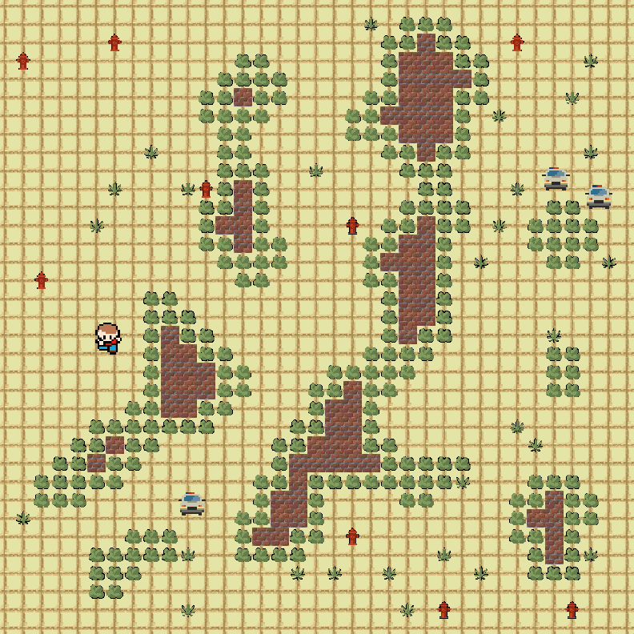
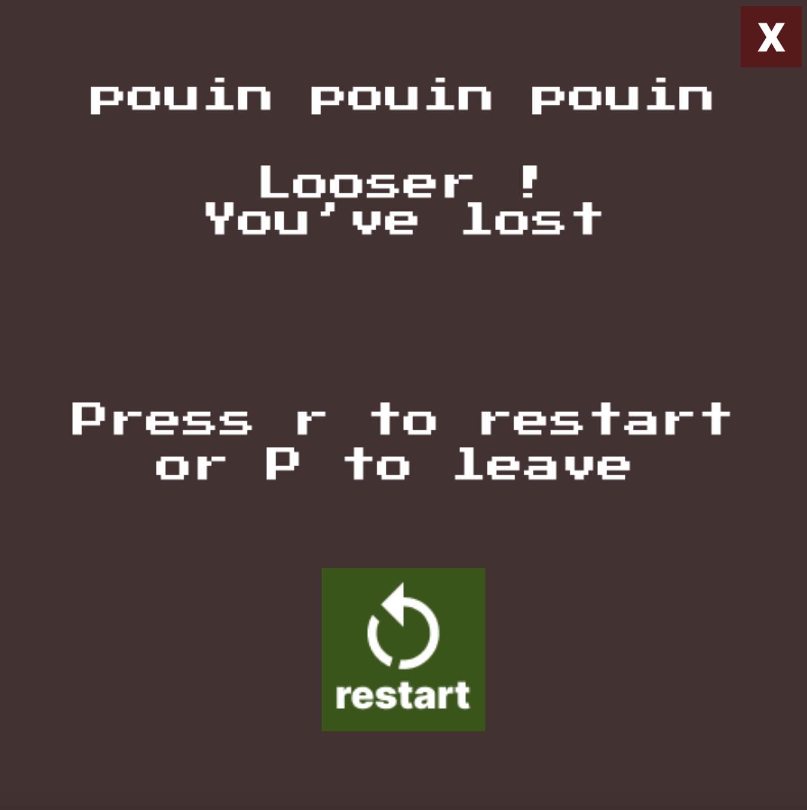

# Projet "city stroll"

Ce projet est un jeu vidéo de type "digger" en C++/OpenGL.  
Le joueur évolue dans une carte générée procéduralement, doit collecter tous les  tout en évitant les ennemis et les pièges. Nous avons choisi comme thème la ville : un personnage se promène dans la rue et ramasse des feuilles tandis que la police lui cours après. Il doit éviter de toucher les pompes à eau. Il peut à tout moment tailler les arbustes qui se trouvent sur son chemin pour passer.

Le joueur se déplace à l’aide des touches ZQSD (ou WASD) et peut creuser ou interagir avec E ou ESPACE.  
Des ennemis patrouillent la carte et poursuivent le joueur grâce à un champ de flux (flow field).  
Le score et le temps sont affichés à l’écran.  
Le jeu se joue en solo et propose une nouvelle carte à chaque partie.

**Commandes principales :**

- `Espace` : démarrer la partie depuis le menu
- `ZQSD` ou fleches directionnelles : déplacer le joueur
- `E` ou `Espace` : creuser/miner
- `P` : quitter le jeu
- `R` : recommencer après une victoire ou une défaite
- `Échap` : quitter certains écrans

## Écran de Démarrage

### Gameplay Principal

### Écrans de Fin

**Ressources :**

- Les ressources ont été crée par nos soins
- Les images et sprites sont dans le dossier `assets/images` ou `assets/textures`.

## Post Mortem

### Ce qui a bien fonctionné

1. **Génération Procédurale** : L'algorithme de cellular automata produit des cartes visuellement intéressantes et jouables
2. **Flow Field AI** : Les ennemis naviguent intelligemment, créant un défi équilibré
3. **Architecture Modulaire** : Séparation claire entre TileMap, Player, Enemy et GameLoop facilite la maintenance

### Problèmes Rencontrés

1. **Génération de Niveaux** : Parfois création de zones inaccessibles malgré les optimisations
2. **Collision Detection** : Système basique qui pourrait être amélioré pour des interactions plus fluides
3. **Audio** : Absence de système audio (musique, effets sonores)

### Améliorations Futures

1. **Power-ups** : Objets spéciaux (vitesse, invincibilité, armes)
2. **Système de Progression** : Déblocage de nouveaux éléments/capacités
3. **Interface Améliorée** : HUD plus riche, menus plus élaborés

**Remarque :**
Ce projet a été réalisé dans le cadre d'un projet de fin d'année en première année d'IMAC.